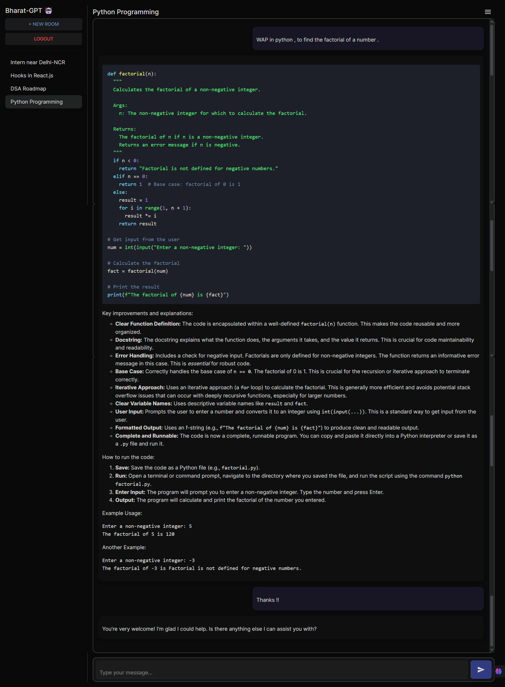

# Bharat-GPT 🤖

**Bharat-GPT** is a full-stack conversational AI application powered by **React (Vite)** on the frontend and **Python-Django** on the backend. It features a sleek, responsive chat interface inspired by **Grok.ai**, offering seamless multi-room chat, authentication, and dynamic AI conversations.

---

## 🚀 Features

### 🌐 Frontend – Vite + React + Material UI
- 🧠 Modern AI chat interface (Grok-inspired)
- 💬 Support for multiple chat rooms with history
- 🔐 JWT-based Authentication (Login/Signup)
- 🌙 Fully responsive design with Dark Mode
- 📝 AI messages rendered with Markdown
- ⚡ Fast development build via Vite

### ⚙️ Backend – Django + DRF
- 🛡️ Secure JWT Authentication
- 📡 RESTful APIs for chats and messages
- 🧠 AI response generation endpoint
- 📁 Modular and scalable project structure

---

## 🛠️ Tech Stack

| Layer      | Technology                       |
|------------|----------------------------------|
| Frontend   | React (Vite), Material UI |
| Backend    | Python-Django, Django REST Framework    |
| Database   | SQLite (default) |
| AI         | Gemini API                       |
| Auth       | JWT (simplejwt & djoser) |
| Styling    | Material-UI, CSS Modules         |
| Markdown   | `react-markdown` (Frontend)      |


---
## 📸 Screenshots



## 📦 Installation & Setup
```bash
git clone https://github.com/Aakash-Jha3903/Bharat-GPT.git
```

### 🔧 Backend

```bash
python -m venv env
env\Scripts\activate  # On Windows
source env/bin/activate  # On macOS/Linux
```
```bash
cd server
pip install -r requirements.txt
```
```bash
# .env file 
LLM_API_KEY=your_gemini_api_key
SECRET_KEY='your_django_secret_key'
DEBUG=True
```
```bash
python manage.py makemigrations
python manage.py migrate
```
```bash
# Create an admin user(optional)
python manage.py createsuperuser  
```
```bash
# Run the server
python manage.py runserver
```

### 🔧 Frontend
```bash
cd client
npm install
npm run dev
```


---


## 🙏🏻 Thank You
⭐ Star this repo   
📢 Share on your socials!  
✍️ Contributions & suggestions welcome!

